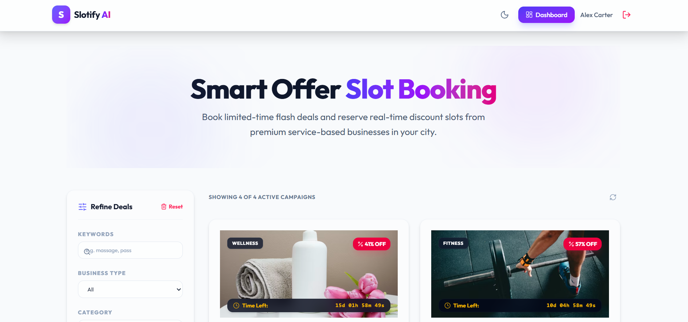
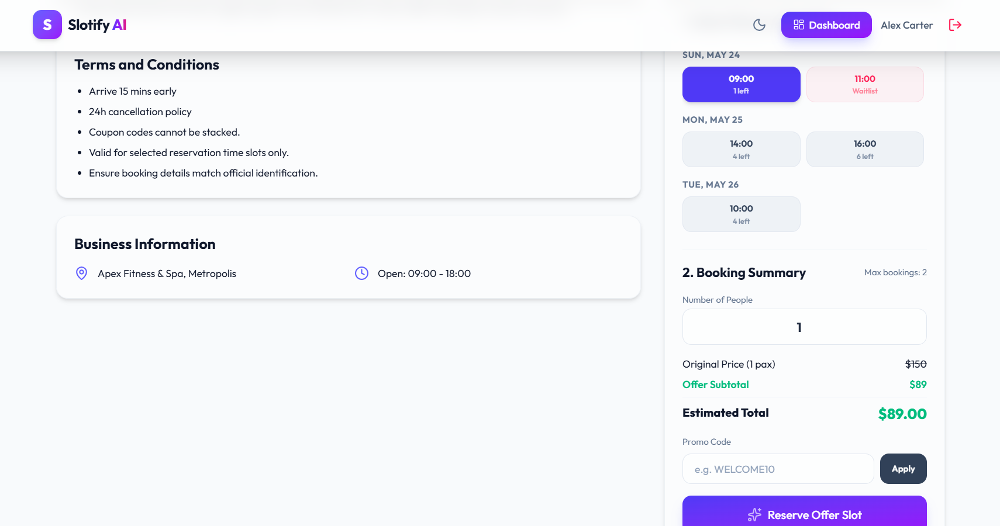
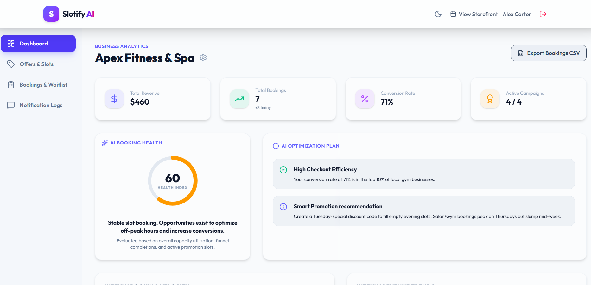
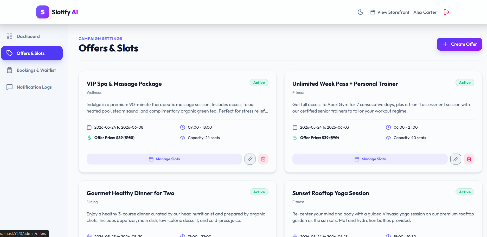
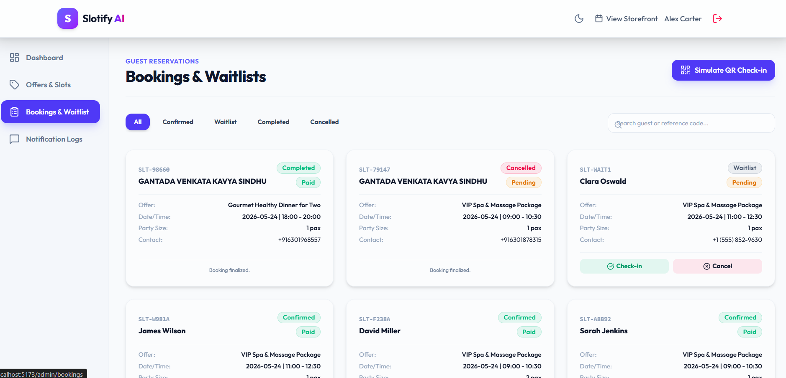
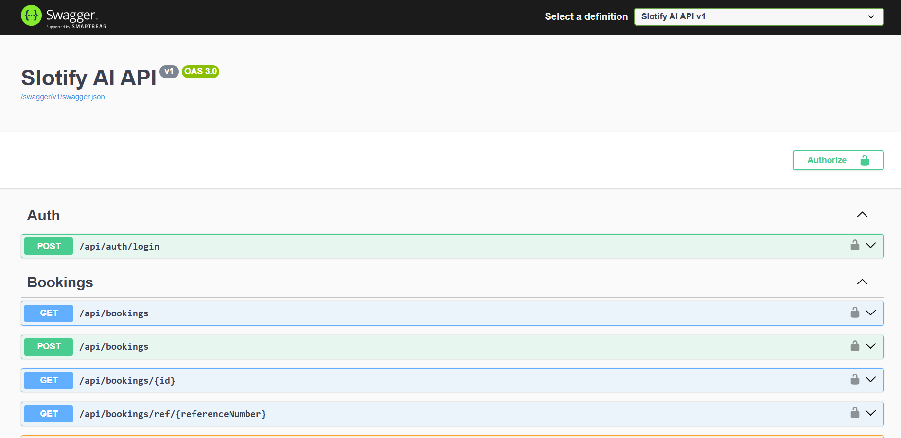

# Slotify AI: Smart Offer Slot Booking System

Slotify AI is an AI-powered marketing and real-time slot reservation system for service-based businesses (gyms, salons, spas, restaurants, and clinics). It enables operators to publish flash deals, adjust slot capacities, automate waitlist promotions, and leverage AI insights to maximize booking efficiency.

---

##  Visual Tour & System Preview

###  Public Storefront

| Public Offers Listing (Home) | Offer Details & Slot Booking |
|:---:|:---:|
|  |  |

###  Admin Management Portal

| Admin Insights & AI Recommendations | Campaign Settings & Slot Management |
|:---:|:---:|
|  |  |

| Guest Bookings & Waitlist Manager | Swagger API Documentation |
|:---:|:---:|
|  |  |

---

##  Tech Stack & Architecture

### Backend (Clean Architecture)
- **Framework**: `.NET 8 Web API`
- **Database**: `PostgreSQL` with `Entity Framework Core`
- **Design Pattern**: Domain-Driven Design (DDD) with Repository & Unit of Work patterns
- **Auth**: JWT Authentication (Bearer scheme)
- **API Documentation**: Swagger / OpenAPI Specification

### Frontend (Modern React)
- **Core**: `React 19`, `TypeScript`, `Vite`
- **Styling**: `Tailwind CSS (v4)` with custom PostCSS plugins and glassmorphism styling
- **Animations**: `Framer Motion` for state transitions and hover micro-animations
- **Charts**: `Recharts` for analytics, demand patterns, and capacity allocation gauges

### 📊 Database Schema & Entity-Relationship (ER) Diagram

Slotify AI uses a structured PostgreSQL schema mapped using Entity Framework Core. Below is the relational model showing how users, businesses, offers, slots, bookings, and notifications are linked:

```mermaid
erDiagram
    USER ||--o| BUSINESS : "manages"
    BUSINESS ||--o{ OFFER : "hosts"
    OFFER ||--o{ OFFER_SLOT : "defines"
    OFFER_SLOT ||--o{ BOOKING : "contains"
    BOOKING ||--o{ NOTIFICATION_LOG : "triggers"

    USER {
        Guid Id PK
        string Email
        string PasswordHash
        string FullName
        DateTime CreatedAt
        DateTime UpdatedAt
    }

    BUSINESS {
        Guid Id PK
        Guid UserId FK
        string Name
        BusinessType Type
        string OwnerName
        string Phone
        string Email
        string Address
        string City
        string LogoUrl
        TimeSpan OpeningTime
        TimeSpan ClosingTime
        DateTime CreatedAt
        DateTime UpdatedAt
    }

    OFFER {
        Guid Id PK
        Guid BusinessId FK
        string Title
        string Description
        string Category
        decimal OriginalPrice
        decimal OfferPrice
        DateTime StartDate
        DateTime EndDate
        TimeSpan StartTime
        TimeSpan EndTime
        int TotalCapacity
        int MaxBookingPerCustomer
        string TermsAndConditions
        string BannerImageUrl
        OfferStatus Status
        bool IsDeleted
        DateTime CreatedAt
        DateTime UpdatedAt
    }

    OFFER_SLOT {
        Guid Id PK
        Guid OfferId FK
        DateTime SlotDate
        TimeSpan StartTime
        TimeSpan EndTime
        int Capacity
        int BookedCount
        SlotStatus Status
        DateTime CreatedAt
        DateTime UpdatedAt
    }

    BOOKING {
        Guid Id PK
        Guid SlotId FK
        string ReferenceNumber
        string CustomerName
        string PhoneNumber
        string Email
        int PeopleCount
        string SpecialNote
        BookingStatus Status
        PaymentStatus PaymentStatus
        string CouponCode
        bool JoinedWaitlist
        DateTime CreatedAt
        DateTime UpdatedAt
    }

    NOTIFICATION_LOG {
        Guid Id PK
        Guid BookingId FK
        string CustomerName
        string Type
        string Destination
        string Message
        string Status
        DateTime Timestamp
    }

    COUPON {
        string Code PK
        string DiscountType
        decimal Value
        decimal MinBookingValue
        bool IsActive
        DateTime CreatedAt
    }
```



---

##  Running the Project

The system is designed with a **Dual-Mode API Architecture**:
1. **Mock API Mode (Default)**: Runs entirely client-side using `localStorage`. Ideal for immediate review and testing without launching database servers.
2. **Real API Mode**: Connects to the live C# backend and PostgreSQL database running inside Docker.

### 1. Launching the Backend & Database (Docker)
Ensure Docker Desktop is running on your system. Open a terminal in the root directory and start the services:
```bash
docker-compose up --build
```
- **Web API Endpoint**: `http://localhost:5000`
- **Swagger Documentation Page**: `http://localhost:5000/swagger/index.html`
- **Database Port**: Mapped to host port **`5433`** (to prevent port conflicts with any local PostgreSQL instance running on default port `5432`).

### 2. Launching the Frontend
Open a new terminal window, navigate to the `frontend` folder, and start the development server:
```bash
cd frontend
npm install
npm run dev
```
Navigate to **`http://localhost:5173`** in your browser.

- **Admin Login Credentials**:
  - **Email**: `admin@slotify.ai`
  - **Password**: `Admin123!`

### 3. Switching to the Real API
To switch the frontend from Mock Mode to communicate with the live .NET container API:
1. Create a `.env` file inside the `frontend` directory:
   ```env
   VITE_USE_REAL_API=true
   VITE_API_URL=http://localhost:5000/api
   ```
2. Restart the frontend dev server (`npm run dev`).

---

##  Implemented Features (Vetted against Requirements)

### A. Admin Dashboard & Login
- **Authentication**: JWT token storage, credentials validation, and private routing.
- **KPI Metrics**: Dashboard displays Total Revenue, Total Bookings, Booking Conversion Rates, and Active Campaigns.
- **Analytics Charts**: Weekly booking velocity (area chart), weekly revenue trends (area chart), and capacity allocation (pie chart).
- **Recent Bookings Table**: Displays guests, selected slots, party size, and current status with action controls.

### B. Business Profile
- **Manage Details**: Admin can update the Business Name, Type, Owner Name, Contact Phone/Email, Address, City, Logo URL, and Opening/Closing Times.
- **Business Types supported**: `Gym`, `Spa`, `Restaurant`, `Salon`, `Clinic`, `Coaching`, `Turf`, `Other`.

### C. Campaign & Slot Management
- **Campaign Configuration**: Creation of time-bound deals with custom pricing, date ranges, and per-guest booking limits.
- **Campaign States**: `Draft`, `Active`, `Paused`, `Expired`, and `Cancelled` states.
- **Subgrid Slots**: Admin can add multiple operational slots for each deal, adjusting operational dates, times, and capacities.

### D. Public Offer Listing Page
- **Advanced Glassmorphic Filters**:
  - *Keywords Search*: Matches titles and descriptions.
  - *Business Type*: Filters offers by local industry type.
  - *Category*: Filters by deal category.
  - *Availability Date*: Filters offers containing slots on a specific date.
  - *Price Range Slider*: Sets a maximum budget limit.
  - *Available Only*: Toggles display of offers with active capacity.
- **Card Fields**: Title, Category, Simulated Business Details, Original Price, Offer Price, Savings percentage, Expiry countdown, and Available seats.

### E. Public Offer Detail & Reservation Flow
- **Countdown Timers**: Real-time ticking timers showing the time left until the deal expires.
- **Coupon Validation**: Supports validation of promo codes (e.g. `WELCOME10`, `SAVE15`).
- **Waitlist Queue**: Fully automated! When booking seats exceed available slots capacity, guests are placed in a waitlist.
- **Waitlist Promotion**: When an administrator cancels a booking, the system automatically promotes the next guest in the queue, recalculating slot capacity and logging simulated notifications.
- **QR Check-in Simulator**: Console simulator on the bookings screen where typing a reference code performs instant guest check-in and completes the payment.
- **Data Exporter**: Export booking records into CSV files for spreadsheets.

---

##  Project Folder Structure

```
├── backend
│   ├── src
│   │   ├── SlotifyAi.Domain           # Entity models, Enums, interfaces
│   │   ├── SlotifyAi.Application      # DTOs, Business Services, validators
│   │   ├── SlotifyAi.Infrastructure   # DBContext, Repositories, Notification Services
│   │   └── SlotifyAi.WebApi           # API Controllers, Middleware, configurations
│   ├── Dockerfile
│   └── SlotifyAi.sln
├── frontend
│   ├── src
│   │   ├── api                        # API connection client
│   │   ├── components                 # Shared UI components (glassmorphism cards, modals)
│   │   ├── contexts                   # Authentication and Theme states
│   │   ├── hooks                      # Custom hooks (e.g., countdown timers)
│   │   ├── layouts                    # Router view layouts
│   │   ├── pages                      # Public and Admin pages
│   │   ├── services                   # AI services and Mock Database
│   │   └── types                      # TypeScript interfaces
│   ├── package.json
│   └── vite.config.ts
├── docker-compose.yml
└── README.md
```
